- [Java Springboot app Notes](#java-springboot-app-notes)
  - [Project Architecture](#project-architecture)
- [Step 1: Create a Git repo](#step-1-create-a-git-repo)
- [Step 2: Deploy the app locally](#step-2-deploy-the-app-locally)
- [Blockers/Errors:](#blockerserrors)
- [Step 3: Deploying app using AWS VM](#step-3-deploying-app-using-aws-vm)
- [DB VM:](#db-vm)
- [APP VM:](#app-vm)
- [Blockers/Errors:](#blockerserrors-1)
- [Step 4: Deploy app and database on AWS using Docker](#step-4-deploy-app-and-database-on-aws-using-docker)
- [Step 5: Deploy app and database on AWS using Kubernetes (Minikube)](#step-5-deploy-app-and-database-on-aws-using-kubernetes-minikube)
- [What I learnt from this project](#what-i-learnt-from-this-project)

## Java Springboot app Notes

### Project Architecture

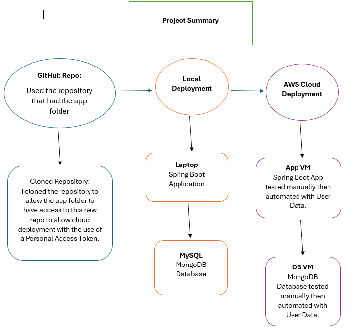

This shows the overall project architecture and the steps I have take to get the app deployed using the cloud with applications and platforms such as Kubernetes and Docker. 

It begins with a GitHub repository containing the application folder. That repository is then cloned into a new repo to ensure that the application folder is accessible for later cloud deployment steps. From there, the workflow proceeds to Local Deployment, where the Spring Boot application runs on a laptop and connects to a local MySQL/MongoDB database for initial testing. Once the application is verified locally, the process moves to AWS Cloud Deployment, where two virtual machines (VMs) are used: one for running the Spring Boot application (App VM) and another for the database (DB VM). Both VMs are tested manually at first and then automated using User Data scripts, enabling consistent, repeatable deployment in the cloud.

## Step 1: Create a Git repo
* Create a Git repo and clone it into Git bash.
* Follow the steps from the README and make sure the repo is private.
* Commands to follow:
  * `git init`
  * `git add .`
  * `git commit -m "Initial commit of file"`
  * `git remote add origin "https://github.com/<USERNAME>/repo-name"` 
  * `git branch -M main`
  * `git push -u origin main`

## Step 2: Deploy the app locally
* In order the get the app working locally, we need to install 3 things:
  *  Java 17
  *  Maven
  *  MySQL
* After installing the right dependencies and verifying by checking the version in the terminal, login to MySQL:
    * Connect manually to root user: `\connect root@localhost` 
    * Make sure you're in MySQL Shell by typing `\sql`
    * `mysql -u root -p`
* Set password to `Burntwood1!` 
* We would need to create the database first as we haven't made it before nor has it been made for us.
  * CREATE DATABASE library;
  * USE library;
* Run this code in the terminal after making sure that your in the app's repo where the file `library.sql` is. This is what will seed the data in the database.
* In the terminal, run: `mysql -u root -p library < library.sql`
* Verify the tables and data by entering this in the MySQL Command line: 
  * `SHOW TABLES;
  * SELECT * FROM authors;
* Once you can see the data, we need to enter the environmental variables.
* The app connects to MySQL using `DB_HOST`, `DB_USER` and `DB_PASS`. I set this in my local machine using the "Windows" button to "edit the system environment variables". 
* `DB_HOST: jdbc:mysql://localhost:3306/library`
* `DB_USER: root`
* `DB_PASS: Burntwood1!`
* After setting the variables, I had to restart the terminal again to make sure that the variables apply.
* After entering the terminal, I made sure to get my file path to the app's directory. Once I'm in the repo I did `cd LibraryProject2`.
* Then I used Maven to start the app: `mvn spring-boot:run`
* After the process runs, look out for these lines:
`Tomcat started on port(s): 5000 (http)`
`Started SpringapiApplication in 3.234 seconds`
* To test the app, in the browser go to: `http://localhost:500/web/authors`. This will show the list of the 4 authors from the database.
* To see all authors: `http://localhost:5000/authors`.
* Single author (ID 3): `http://localhost:5000/author/3`
* To stop the app: `mvn spring-boot:stop`

## Blockers/Errors:
* I had the longest time trying to fix the app using Java V17 even after installing the correct one.
* The app was continously using Java V1 and I couldn't understand why.
* I just opened a new terminal and checked the version that the app was to use after doing `java -version` and when it said 17, I understood that it now works. 
* Also, I created a new environmental variable named "JAVA_HOME" and set it to JDK's path.
* Then under "System variables", I found "Path" and created a new variable: `%JAVA_HOME%\bin`.

## Step 3: Deploying app using AWS VM
* I created 2 VM. One for DB and one for the app.
## DB VM: 
* Ubuntu 22.04 EC2 instance with t3.micro image (free tier).
* Key pair: tech511-afsheen-aws
* Security Groups:
  * Allow SSH (port 22)
  * Add Security Group rule:
    * Type: MYSQL/Aurora
    * Port: 3306
    * Source: Custom
    * Enter: 0.0.0.0/0 (for testing)
    * Add User Data 
* After launching the instance, I SSH'd into a new terminal and typed in `sudo systemctl status mysql`.
* This showed "active" which told me that everything was working well.
## APP VM:
* Ubuntu 22.04 EC2 instance with t3.micro image (free tier)
* Key pair: tech511-afsheen-aws
* Security Groups:
* Allow SSH (port 22)
* Custom TCP (port 5000) (for app web access)
* Add User Data but make sure that you type in the Private IPv4 address from the DB VM.
* From the User Data, enter your github username and repo name.

* To verify everything works, got to the app VM and be in the java app repo where `pom.xml` is. Click on the public IPv4 address from the app VM: `http://<APP_PUBLIC_IP>:5000/web/authors`
* Make sure you have cloned the repo in the DB VM. I had not done this and had to do a `git clone` using a new SSH key token since the repo is private and I couldn't remember the username and password it was asking for. 
* In the App VM, to build the app, I did this: `./mvnw clean package -DskipTests`

## Blockers/Errors:
* I had problem with SQL rejecting permissions for the app to access the database even though it could. It only gave access for 'root' to access the db. 
* I had to change the environmental variables in the bash scripts/user data that changed the permissions to allow the app to access the DB. 
* Also, I kept on forgetting to get to the correct file path that wasn't getting the app deployed.
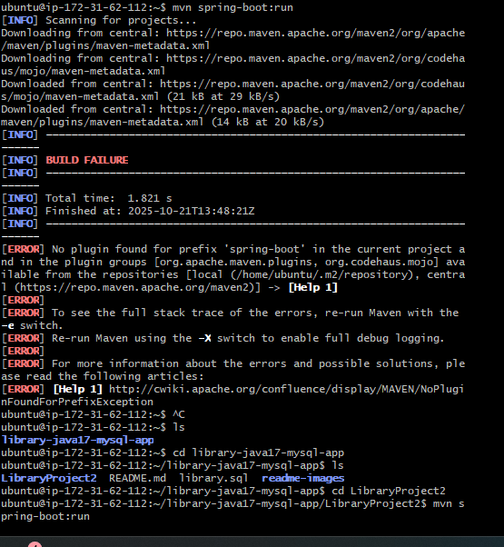
* One error I got was that MySQL was not recognising the environment variables I set and constantly asked for variables to start with JBDC. To fix this I had to set the environmental variables again:
  * `export SPRING_DATASOURCE_URL=jdbc:mysql://172.31.25.143:3306/library`
  * `export SPRING_DATASOURCE_USERNAME=root`
  * `export SPRING_DATASOURCE_PASSWORD=Burntwood1!` 
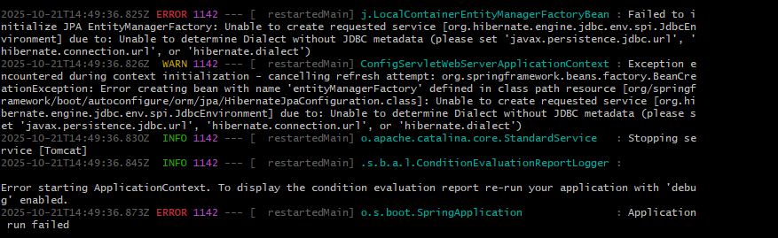

## Step 4: Deploy app and database on AWS using Docker
* To start of this task, I went on to create an EC2 instance on AWS using an `22.04 LTS AMI`, a `t3.small` instance type and inbound ports 22, 80, 3000, and 27017.
* I then added user data:
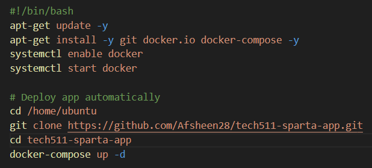
* Once the instance had launched, I SSH'd into the VM.
* I then cloned my `app` folder from my `tech511-sparta-app` to this `java-spring-boot-app-notes` repository. This is because the app folder was not in this repo.
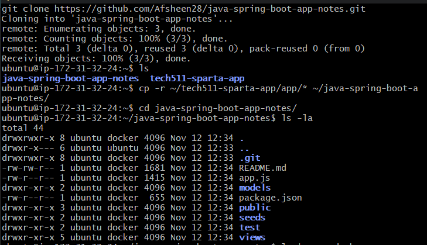
* Once the app folder was in the repo, I created a `docker-compose.yml` and `provision.sh` file.
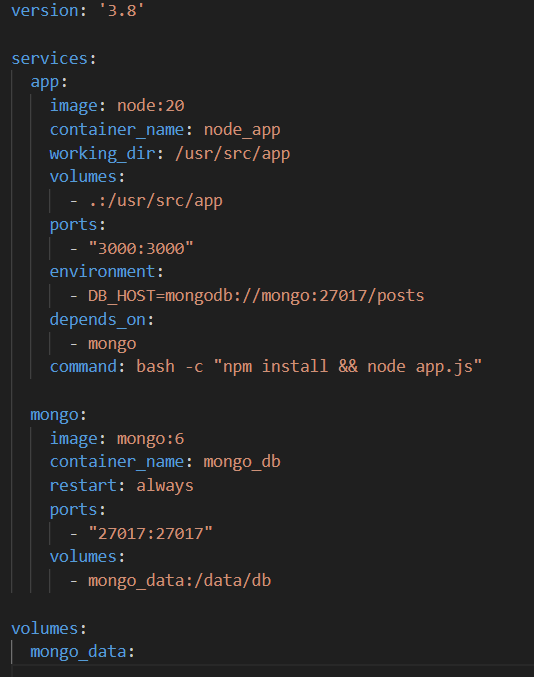
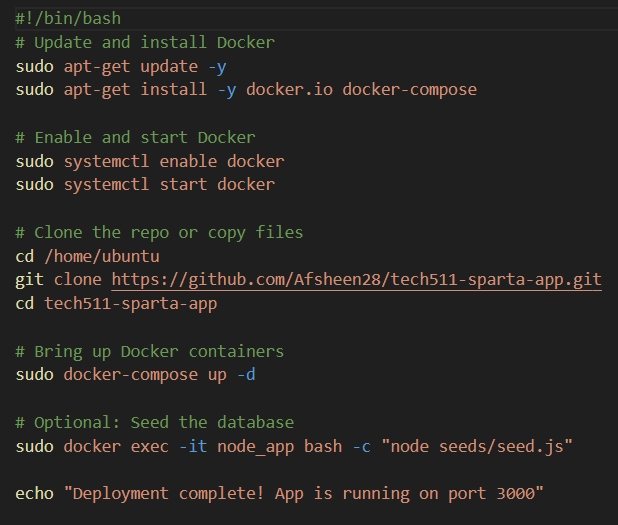
* I then updated the system and installed the required packages (like docker):
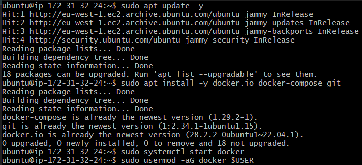
* I then gave user permissions to run Docker without `sudo`. By default only root can access Docker. Adding the `ubuntu` user to the docker group allows Docker commands without `sudo`.
* 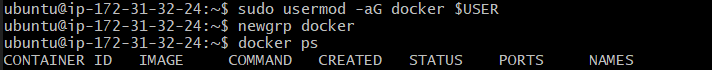
* I then verified docker access by running `docker ps`. This confirmed that Docker was working and accessible to the user. An empty table was shown meaning that no containers were running yet which was true.
* I then deployed the containers by running `docker-compose up -d`. This launched both the Node.js and MongoDB containers in detached mode. Compose automatically created an internal network linking the app to the database.
* After that, I ran `docker ps` to verify both servics were running and mapped to their ports.
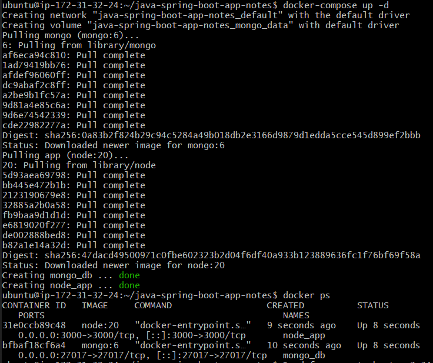
* I then tested the application by going on `http://<EC2_PUBLIC_ID>:3000` and `http://<EC2_PUBLIC_ID>:3000/posts`
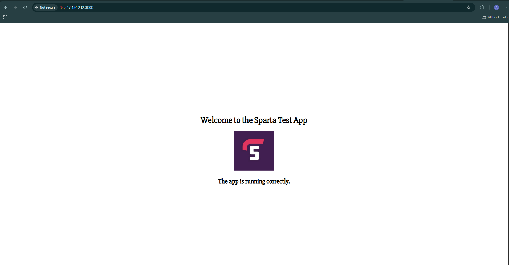
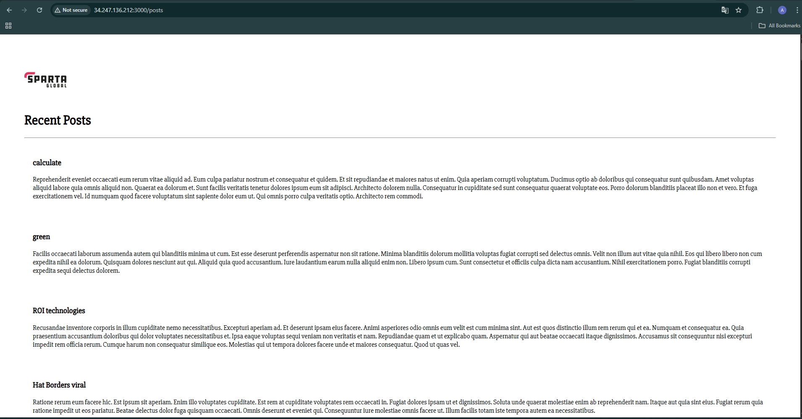

## Step 5: Deploy app and database on AWS using Kubernetes (Minikube)
* Firstly, I created an EC2 instance with an instance type of t3.medium due to the RAM size I needed. I also added the following inbound rules in the security group.
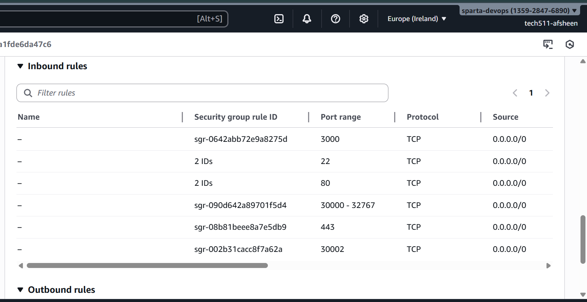
* I then added user data:
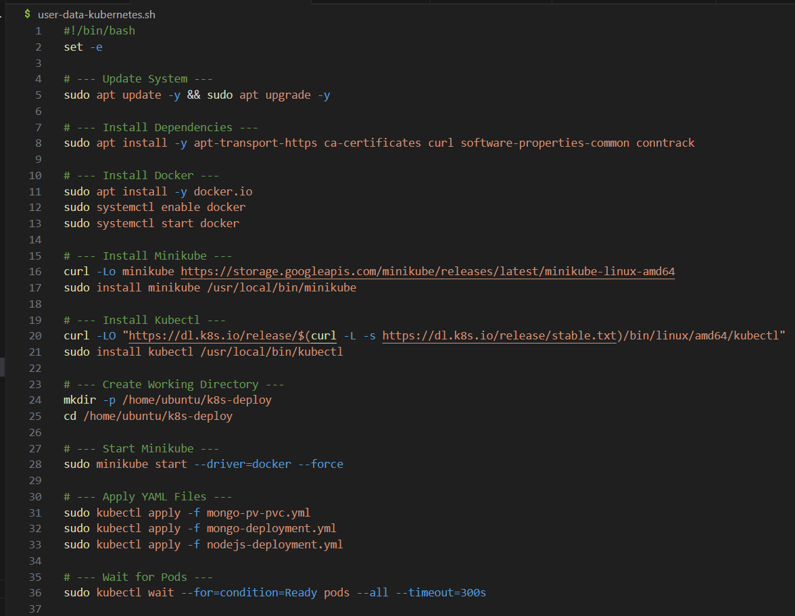
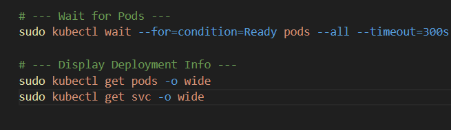
* Once I launched the instance, and SSH'd into a new Gitbash terminal, I created a repository named `k8s-deploy` and created 3 YAML files.

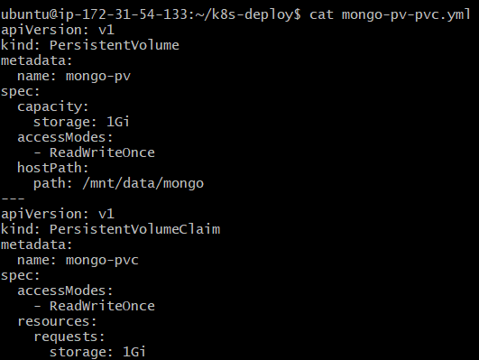

* I then went to start minikube by running `minikube start --driver=docker --memory=2500mb`
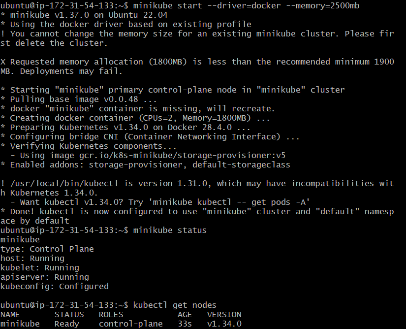
* Minikube had initially warned that the memory allocation (1800MB) was below the recommended limit (1900MB). I then recreated the Minikube cluster with the sufficient memory (2.5GB) and confirmed the status as shown in the picture above.
* I then went ahead and applied the YAML files by running `kubectl apply -f fileName.yml`.
* 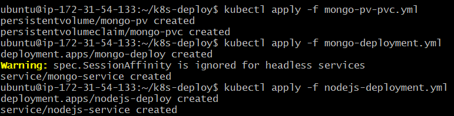
* I then ran `kubectl get pods` and `kubect get svc` to check everything was running.
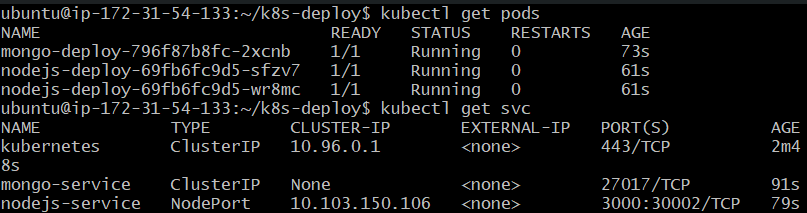
* Both MongoDB and Node.js pods were healthy and responding. 
* I then tested the app's internal status
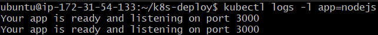 
* Next, I went on to forward the port to 3000 to allow us to see the app running.
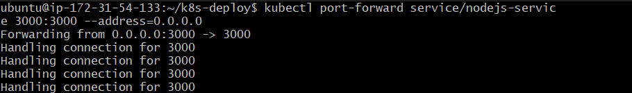
* I then went to the public IP + port 3000 of the instance and found the app working.
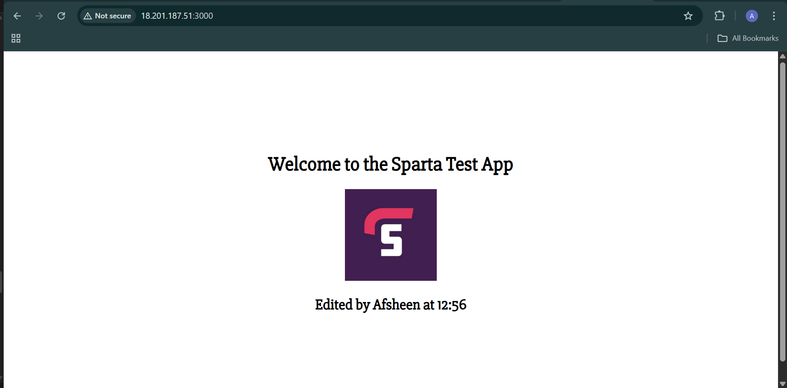
* I then had to seed the database but was not sure what the file path of the `seed.js` was so asked ChatGPT to give me a solution and asked me to run a few commands using one of the Node.js pods where I was then able to seed the database.
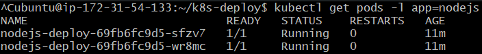
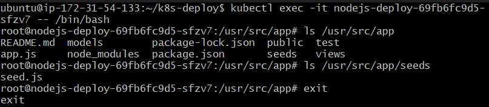
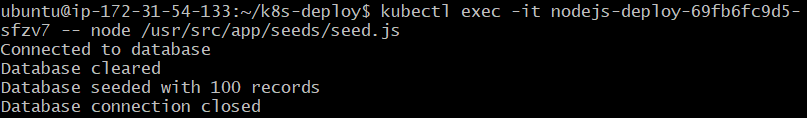
* I then went to the browser and tried the /posts page to check if the database had worked.
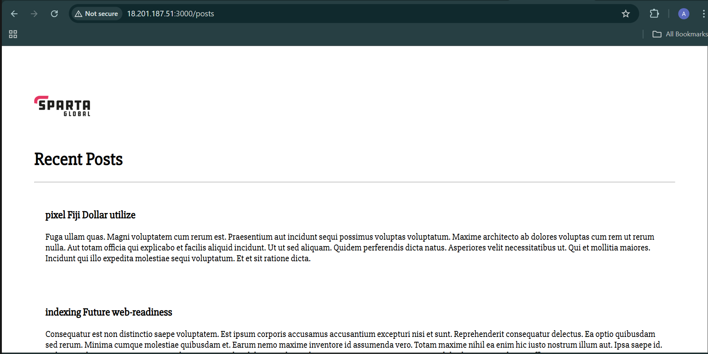

## What I learnt from this project
During this project, I was able to learn how to deploy an application from end to end using a GitHub repository and SQL seed scripts. Once I started using virtual machines, I was able to using Bash scripts that run through cloud user data, allowing the app and database VMs to configure themselves on startup. I then learned how to containerise my application using Docker, write Dockerfiles, create docker-compose configurations, build and push images to Docker Hub, and deploy them through a single VM provisioning script. I advanced to use Kubernetes to create YAML files to orchestrate the app and database on one machine, with another automated script setting up Kubernetes and applying all configurations. This made me develop my hands-on experience for platforms I had never used before and made me confident on using them as I learnt more about why we use them and what they do along the way. 